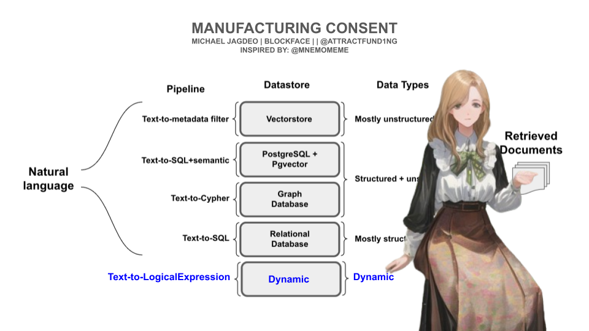
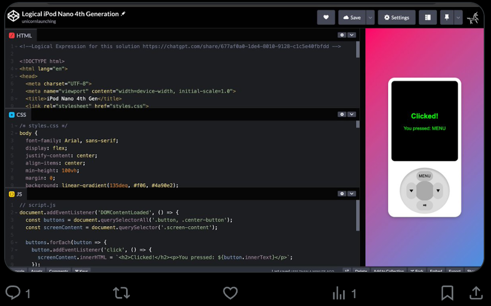

# LOGICK: PROMPT LIKE AN EGYPTIAN: Manufacturing Consent [from LLMs]

In a recent report - The Prompt Report: A Systematic Survey of Prompting Techniques http://arxiv.org/pdf/2406.06608 -  a seemingly comprehensive report on the state of AI prompting was systematically reviewed. In it, 33 vocabulary terms, a taxonomy of 58 LLM prompting techinques, and 40 techniques for other modalities were discussed. However, at no point in the paper did they mention the word predicate.

## There is a massive, gaping hole in that paper. This paper fills that hole.

## The Syndicate

Author: Blockface | @attractfund1ng | Michael Jagdeo

Contributors: Mnemomeme, Oma Cox, BeatCheek, Rocky Nguyen, Seraph_Notitia,
Quinn C. Martin, Potato Stu, Eileen Jan, Ayden Springer, Matios Berhe, Liminal Snake

Timestamp: Sat Jan 4 2024 10:34PM EST

## Abstract

#### Prompting with predicate and propositional and modal logic offers a more precise and structured approach compared to natural language, leading to focused outputs with minimal token usage. Adding Esperanto and Kolmogorov Complexity further optimizes this method.

Unlike natural language prompts, which can introduce ambiguity and require longer explanations to clarify intent, logic-based prompts reduce redundancy and optimize both computational efficiency and output quality. By expressing queries through formalized logical structures, we minimize unnecessary complexity, making interactions with Large Language Models (LLMs) more effective. This paper explores how leveraging predicate and propositional logic in prompt engineering can significantly improve response relevance, clarity, and performance. Furthermore, we discuss novel methods for implementing these approaches, including the development of predicate and propositional logic pre-processors that can optimize token usage, improve response quality, and reduce computational overhead. These advancements provide a more efficient method for engaging with LLMs, resulting in significant cost savings across compute, network, storage, bandwidth, and AI inference latency. These findings work with ALL LLMs.

