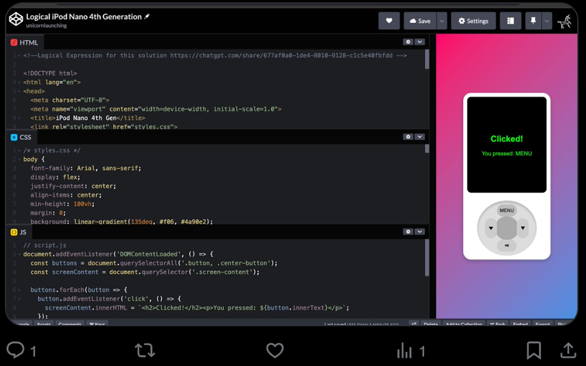

# Executive Summary: Developing the iPod Nano 4th Generation Web Solution

This markdown file details the systematic evolution of logical expressions and their natural language equivalents that guided the development of a web-based iPod Nano 4th Generation replica. The final solution leverages **HTML**, **CSS**, and **JavaScript** for a fully interactive and responsive design.

---

## **Process Overview**

### **1. Initial Logical Expression**
The first logical expression outlined the fundamental requirements for the solution:

#### **Logical Expression**  
\[
\exists x (\text{BeautifulSolution}(x, \text{IPodNano4thGen}) \land \text{Implements}(x, \text{WheelControls} \land \text{ScreenDisplay}))
\]

#### **Natural Language Equivalent**  
"There exists a solution \(x\) that is both beautiful and implements wheel controls and a screen display for the iPod Nano 4th Generation."

---

### **2. Expanded Logical Expression**
The next iteration introduced interactivity and responsiveness:

#### **Logical Expression**  
\[
\exists x (\text{BeautifulSolution}(x, \text{IPodNano4thGen}) \land \text{Implements}(x, \text{WheelControls} \land \text{ScreenDisplay} \land \text{AudioFeedback}) \land \text{Uses}(x, \text{ResponsiveDesign}))
\]

#### **Natural Language Equivalent**  
"There exists a beautiful solution \(x\) for the iPod Nano 4th Generation that includes wheel controls, a screen display, audio feedback, and responsive design."

---

### **3. Modal Logic Enhancement**
This iteration added necessity (\(\Box\)) and possibility (\(\Diamond\)) to express interactivity requirements:

#### **Logical Expression**  
\[
\Diamond \exists x (\text{BeautifulSolution}(x, \text{IPodNano4thGen}) \land \text{Implements}(x, \text{InteractiveComponent}(\text{WheelControls} \land \text{ScreenDisplay} \land \text{AudioFeedback})) \land \Box(\text{Uses}(x, \text{HTML} \land \text{CSS} \land \text{JavaScript} \land \text{ResponsiveDesign})))
\]

#### **Natural Language Equivalent**  
"It is possible (\(\Diamond\)) for a solution \(x\) to exist that is beautiful, includes interactive components like wheel controls, a screen display, and audio feedback, and necessarily (\(\Box\)) uses HTML, CSS, JavaScript, and responsive design."

---

### **4. Unified Logical Expression**
The final, unified expression combined all prior iterations into a single, comprehensive representation:

#### **Logical Expression**  
\[
\Diamond \exists x (\text{BeautifulSolution}(x, \text{IPodNano4thGen}) \land \text{Implements}(x, \text{InteractiveComponent}(\text{WheelControls} \land \text{ScreenDisplay} \land \text{AudioFeedback})) \land \Box(\text{Uses}(x, \text{HTML} \land \text{CSS} \land \text{JavaScript} \land \text{EventHandlers} \land \text{ResponsiveDesign})) \land \text{OptimizedFor}(x, \text{Aesthetics} \land \text{Usability}))
\]

#### **Natural Language Equivalent**  
"A solution \(x\) possibly (\(\Diamond\)) exists that is beautiful, includes interactive components (wheel controls, a screen display, and audio feedback), necessarily (\(\Box\)) uses HTML, CSS, JavaScript, event handlers, and responsive design, and is optimized for aesthetics and usability."

---

## **Final Solution**

